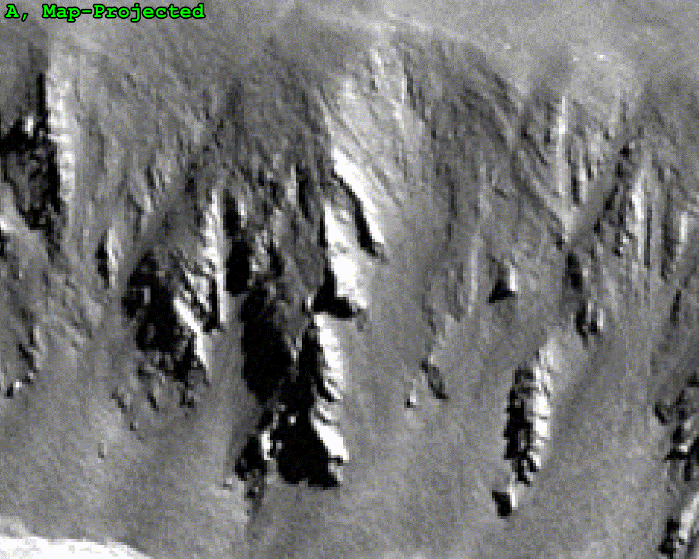

# Processing SPOT6/7 Images with the Ames Stereo Pipeline

This repository is associated with:

  _Purinton, B.; Mueting, A.; Bookhagen, B. Image Texture as Quality Indicator for Optical DEM Generation: Geomorphic Applications in the Arid Central Andes. Remote Sensing. 2022. In review._


**BEFORE YOU BEGIN PROCESSING READ ALL INSTRUCTIONS HERE:**

Prior to running the Ames Stereo Pipeline on the SPOT6 images, we convert them from their native, tiled format with external Rational Polynomial Coefficient (RPC) files, to a GeoTiff format with the RPC data contained in the file header using the following GDAL command. Since Ames also needs the original *.xml RPC file for processing purposes to be fed into the pipeline at various steps, we also rename this file to match our GeoTiff filename. These commands are run in each of the three directories containing the A, B, and C tristereo images:

```
cd /path/to/SPOT6-A-image/tiles/
gdal_translate DIM_SPOT6_*.XML A.tif -co TILED=YES
cp RPC_SPOT*_*.XML A.XML

cd /path/to/SPOT6-B-image/tiles/
gdal_translate DIM_SPOT6_*.XML B.tif -co TILED=YES
cp RPC_SPOT*_*.XML B.XML

cd /path/to/SPOT6-C-image/tiles/
gdal_translate DIM_SPOT6_*.XML C.tif -co TILED=YES
cp RPC_SPOT*_*.XML C.XML
```

Once this is done, you should generate a directory with a shortname for the area you are working in (e.g., for us it was `Pocitos`), and place the `A.tif`, `B.tif`, `C.tif` and `A.XML`, `B.XML`, `C.XML` files in a subdirectory called `merged_tiles` (i.e., `Pocitos/merged_tiles/`).

Prior to running `ames_spot_processing.sh` you need to place the script in the directory of your SPOT processing (e.g., `Pocitos/ames_spot_processing.sh`), make sure you are inside this directory at the command line (e.g., `cd /path/to/Pocitos`), and make sure you have donwloaded and installed the Ames Stereo Pipeline and you can access all commands from your current command line.

Once you have completed these steps, the processing parameters that you may wish to change are on line numbers `12-39` in the `ames_spot_processing.sh` shell script. Descriptions are provided inline, but we note the **alignment DEM at line `18`**. You will need to make a new subdirectory called `Alignment_DEMs` (e.g., `Pocitos/Alignment_DEMs`), and in there you should put a coarse (i.e., 30 m) DEM that will be used for co-registration and map-projection (Steps 5-7 in our publication Section 3.2.3). It is up to the user to source and appropriate DEM for this step, but we recommend the [Copernicus](https://portal.opentopography.org/raster?opentopoID=OTSDEM.032021.4326.3).

**Once you have completed _ALL_ of the above pre-processing steps you are ready to run the shell script!**

Output processing logs will be found in the `asp_logs/` subdirectory (e.g., `Pocitos/asp_logs/`) and all DEM results will be found in the `asp_out/` subdirectory (e.g., `Pocitos/asp_out/`).


# SPOT6 A scene prior to and following map-projection


# Difference (disparity) between SPOT6 A and C scenes following individual map-projection

